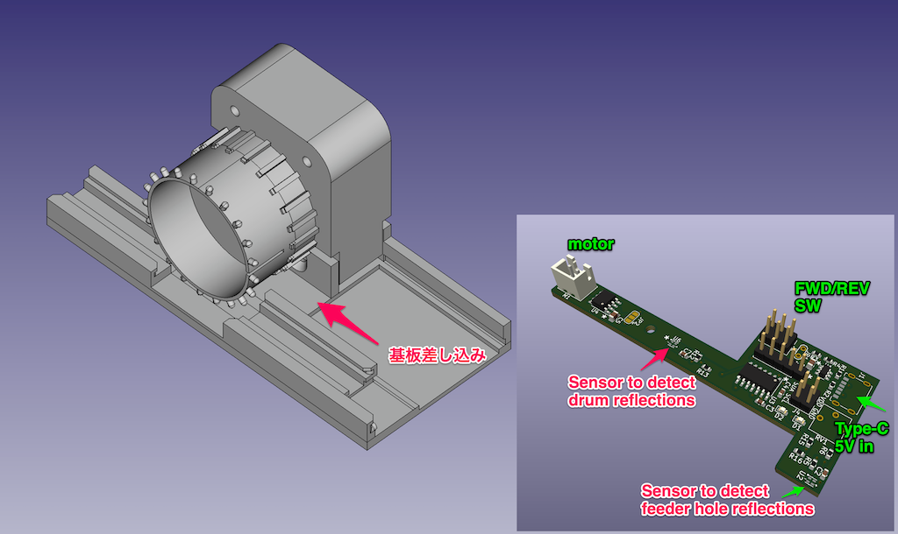
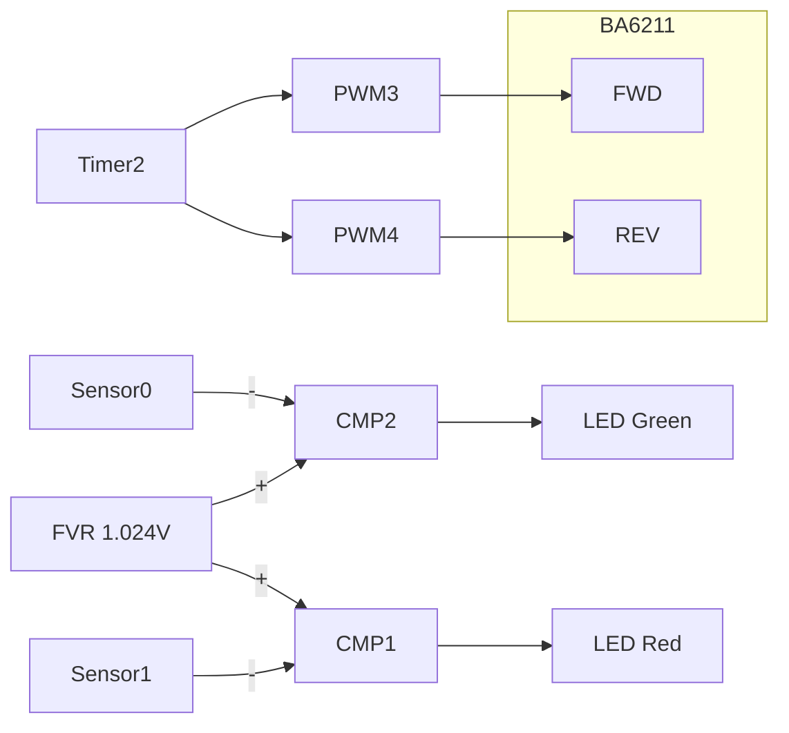
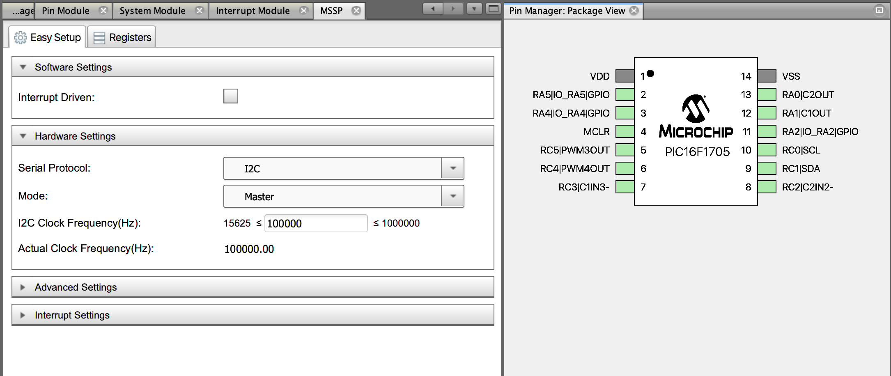
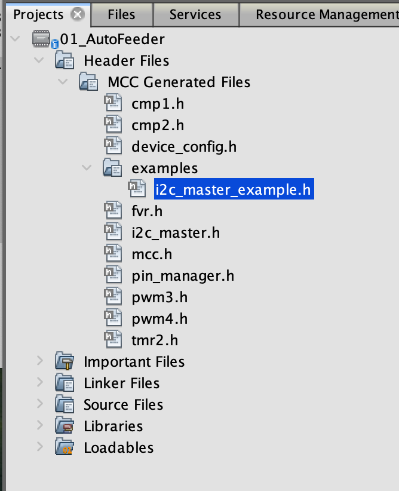
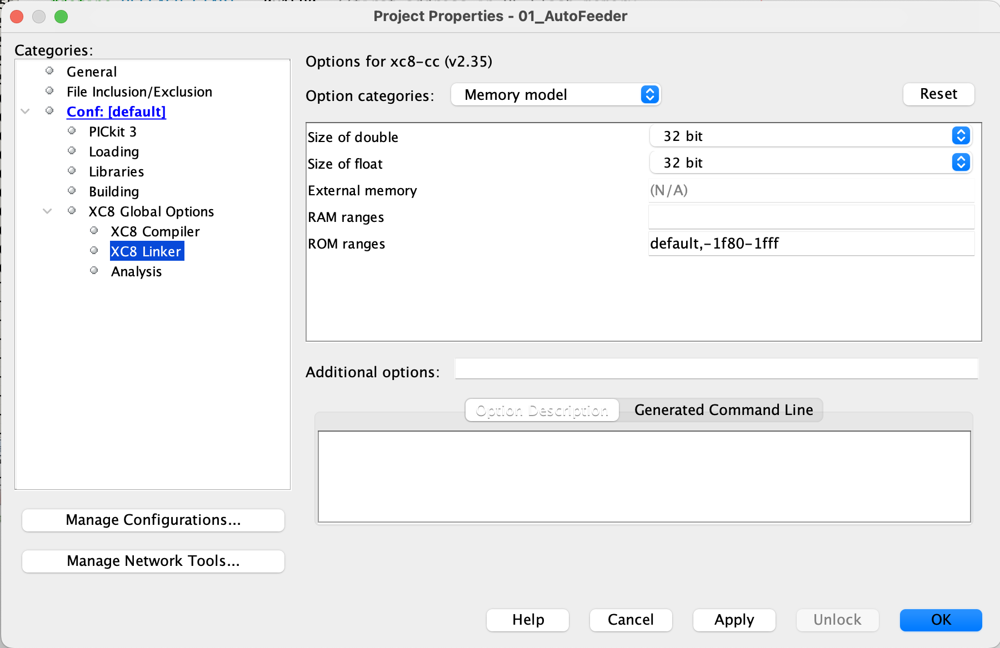
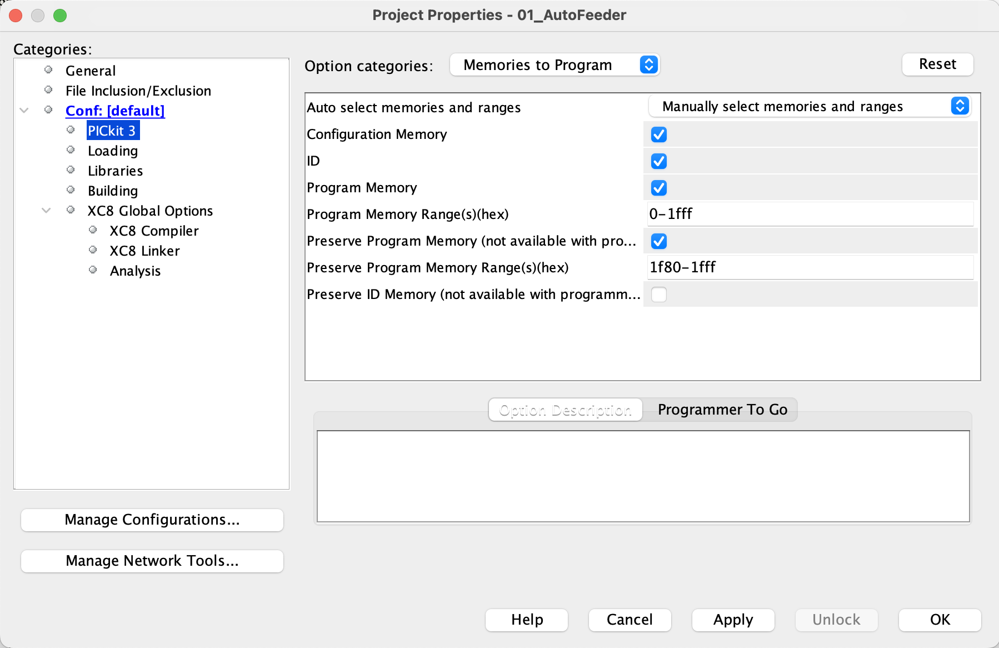

# 01_AutoFeeder.X

This is a test project for an auto-feeder for CompactPnP. When the switch is pressed, the feeder moves one frame. It includes a program and a schematic. The program was written in PIC MPLAB X IDE. The schematic is written in KiCAD and the printed circuit board is made. The structure was made with a 3D printer.

---
これはCompactPnP用のオートフィーダーのテスト用プロジェクトです。スイッチが押されるとフィーダーが一コマ移動します。プログラムと回路図を含みます。プログラムはPIC MPLAB X IDEで書きました。回路図はKiCADで書き、プリント基板を作っています。構造物は3Dプリンターで作りました。

---
### Rev.01
* [demo](image/ezgif.com-video-to-gif-converted.gif)
* [schematics](schematics/AutoFeeder_Drum-type_new/20231123_R1/AutoFeeder_Drum-type.pdf) 
* block chart

---
### Rev.02
* [demo](image/20240212_AutoFeederTest-ezgif.com-video-to-gif-converter.gif)
* [schematics](schematics/AutoFeeder_Drum-type_new/20240107_Rev02/AutoFeeder_Drum-type.pdf) 
---
---
### Tips

* PIC16F1705でI2C を設定する。何故か400kHzに設定するとハングします。「Registers」で SSP1ADD = 0x9 (=400KHz)に設定することは可能。
  
  Setting I2C on the PIC16F1705. It hangs when set to 400kHz. It is possible to set SSP1ADD = 0x9 (=400KHz) in "Registers".
  

* このサンプルコードがよく出来ていてそのままincludeして使える。
  This sample code is well done and can be included and used as is.
  

* HEF-block範囲にプログラムが書かれないようにする設定。
  Settings to prevent programs from being written in the HEF-block range
  

* PICに書いた時にHEFブロックが初期化されない設定。
  Settings to prevent the HEF-block from being initialized when writing to the PIC
  

