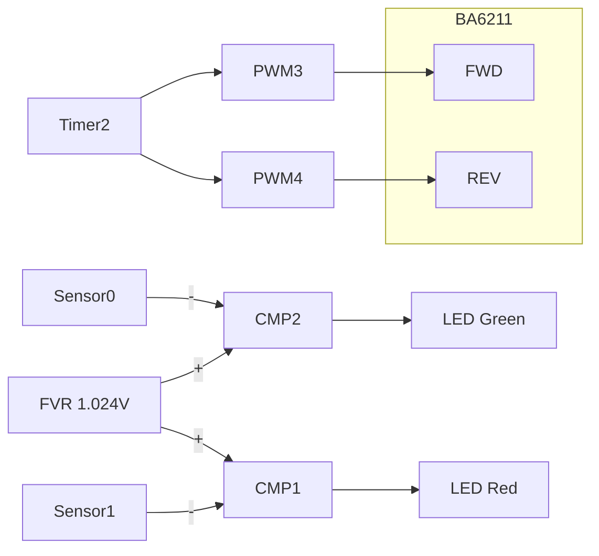

# 01_AutoFeeder.X

This is a test project for an auto-feeder for CompactPnP. When the switch is pressed, the feeder moves one frame. It includes a program and a schematic. The program was written in PIC MPLAB X IDE. The schematic is written in KiCAD and the printed circuit board is made. The structure was made with a 3D printer.

---
これはCompactPnP用のオートフィーダーのテスト用プロジェクトです。スイッチが押されるとフィーダーが一コマ移動します。プログラムと回路図を含みます。プログラムはPIC MPLAB X IDEで書きました。回路図はKiCADで書き、プリント基板を作っています。構造物は3Dプリンターで作りました。

---
＜image＞  
[demo](image/ezgif.com-video-to-gif-converted.gif)

＜回路図＞  
[REV.01](schematics/AutoFeeder_Drum-type.pdf) 

＜PIC内ブロック図＞

---
